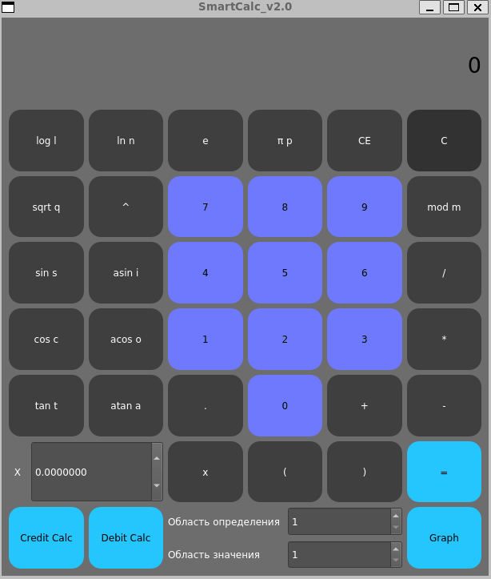
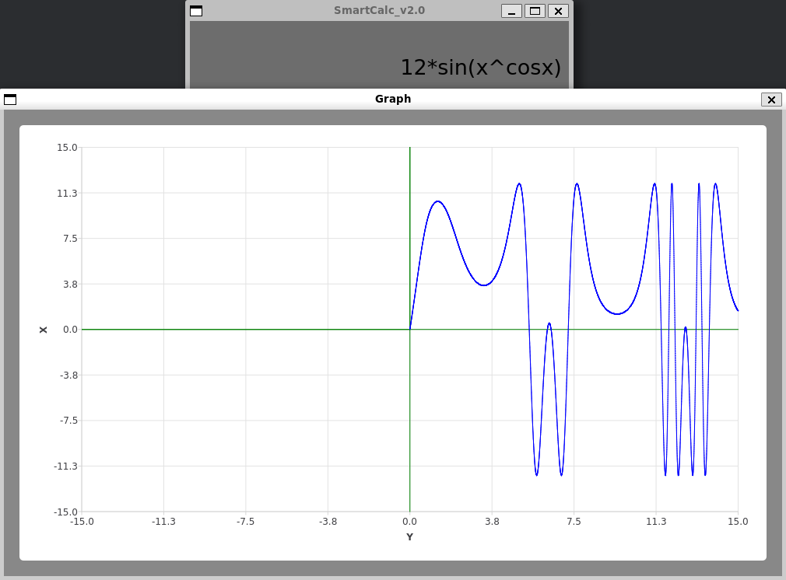
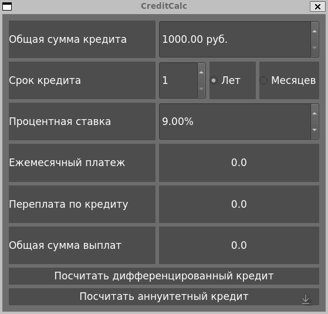
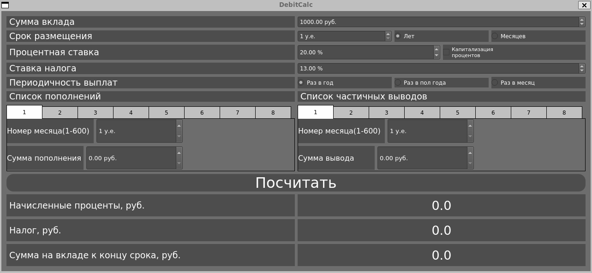

# Проект Умного калькулятора на языке C++ с использованием модели MVC

    

        <h1>Добро пожаловать на мой проект!</h1>
        <h2>Содержание</h2>
        

            <ul style="margin: 0;">
                <li><a href="#установка">Установка</a></li>
                <li><a href="#умный-калькулятор">Умный Калькулятор</a>
                    <ul>
                        <li><a href="#калькулятор">Интерфейс калькулятора</a></li>
                        <li><a href="#график-функции-f--x--от-уравнения">График функции f(x) от уравнения</a></li>
                    </ul>
                </li>
                <li><a href="#кредитный-калькулятор">Кредитный калькулятор</a>
                    <ul>
                        <li><a href="#аннуитетный-кредит">Аннуитетный кредит</a></li>
                        <li><a href="#дифференцированный-кредит">Дифференцированный кредит</a></li>
                    </ul>
                </li>
                <li><a href="#депозитный-калькулятор">Депозитный калькулятор</a>
                    <ul>
                        <li><a href="#депозитный-вклад">Депозитный вклад</a></li>
                    </ul>
                </li>
            </ul>
        

        

            
        

        <h2 id="установка">Установка</h2>
        Для установки нужно следовать этим шагам:
        1. Склонировать <a href="https://repos.21-school.ru/students/CPP3_SmartCalc_v2.0.ID_353536/kegsbett_student.21_school.ru/CPP3_SmartCalc_v2.0-1.git">репозиторий</a>
        2. Перейти в директорию src
        3. Ввести команду <a href="https://www.gnu.org/software/make/manual/make.html">`make`</a>
        4. Установка приложения произойдет в директорию app в корне репозитория и создастся ярлык на рабочем столе
    
        <h2 id="умный-калькулятор">Умный Калькулятор</h2>
        Данный калькулятор считает выражение по всем законам математики. 
        Все действует в приоритетности: Унарный знак и функция - Степень - Бинарные операторы(стандарт). 
        При желании скобки изменят приоритетность.  
        Все кнопки в представлении через контроллер вызывают соответствующие функции модели 
        А затем контроллер вызывает итоговый результат и изменяет вывод в представлении 
         
        В калькуляторе есть возможность подставить в уравнение X и либо назначить его числом в соответствующем окошке,
        либо нажать на кнопку ***Graph*** и откроется график для всей области определения. 
        Область определения(xAxis) и область значения(yAxis) задаются в соответствующих окошках.

        <h3 id="калькулятор">Интерфейс калькулятора</h3>
        

            
        

    
        <h3 id="график-функции-f--x--от-уравнения">График функции f(x) от уравнения</h3>
        

            
        

    
        <h2 id="кредитный-калькулятор">Кредитный калькулятор</h2>
        

            
        

        <h3 id="аннуитетный-кредит">Аннуитетный кредит</h3>
        Аннуитетный кредит - это тип кредита, который предусматривает фиксированные ежемесячные платежи на протяжении всего срока кредита.
        Он наиболее распространенный вид кредита, который предоставляется банками на различные цели, включая покупку недвижимости, автомобиля
        или других крупных покупок. При аннуитетном кредите сумма выплаты состоит из частей по погашению основной суммы кредита и по выплате процентов.
        В начале срока кредита часть выплаты состоит в основном из процентов, но со временем эта доля уменьшается, а доля по погашению основной суммы
        кредита увеличивается.

        <h3 id="дифференцированный-кредит">Дифференцированный кредит</h3>
        Дифференцированный кредит - это тип кредита, при котором ежемесячные выплаты состоят из фиксированных платежей по основному
        долгу и процентам на протяжении всего срока кредита. Этот тип кредита часто используется для кредитования малого бизнеса или личных
        нужд. При дифференцированном кредите размер ежемесячных платежей уменьшается по мере уменьшения основной суммы кредита. Однако общая сумма,
        выплачиваемая за кредит, может быть выше, чем при аннуитетном кредите, потому что в начале срока кредита доля выплат по процентам выше,
        чем при аннуитетном кредите, что увеличивает общую сумму выплат.

        <h2 id="депозитный-калькулятор">Депозитный калькулятор</h2>
        

            
        

        <h3 id="депозитный-вклад">Депозитный вклад</h3>
        Депозитный вклад - это тип банковского продукта, при котором клиент размещает свои деньги на определенный срок в банке,
        получая за это определенный процентный доход. Депозитный вклад является одним из наиболее надежных и простых способов сохранения
        и приумножения своих денежных средств.

